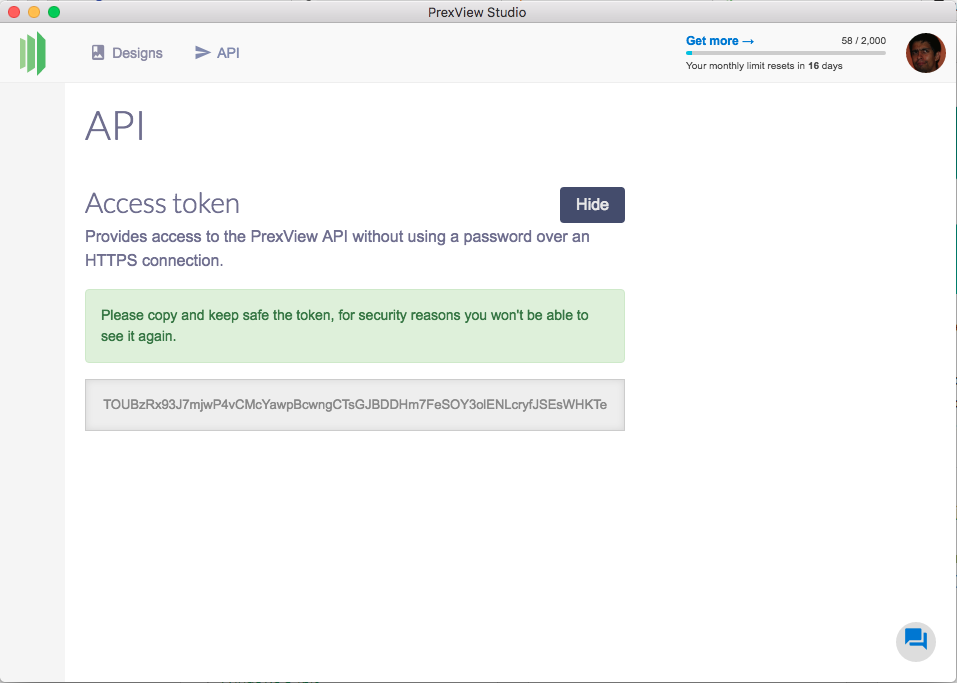
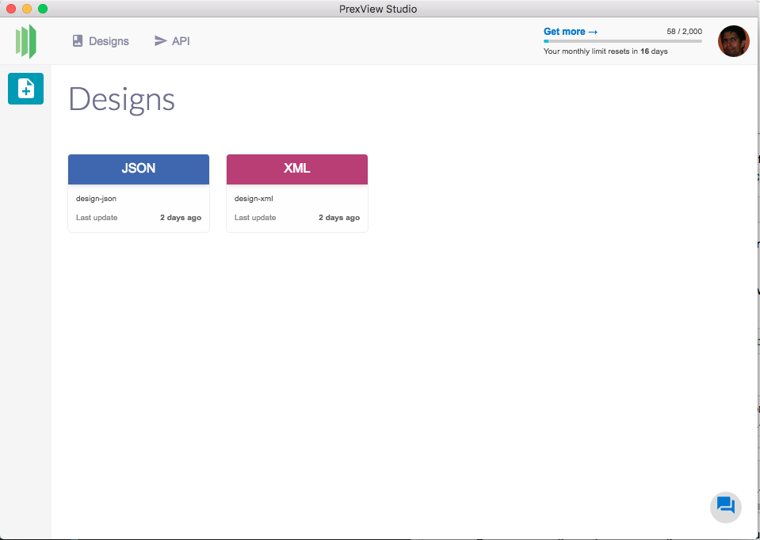

# PrexView

A composer library to use PrexView a fast, scalable and very friendly service for programatic HTML, PDF, PNG or JPG generation using JSON or XML data.


## Installation

Add this line to your application's Gemfile:

```ruby
gem 'PrexView'
```

And then execute:

    $ bundle

Or install it yourself as:

    $ gem install PrexView

## Quick Start

Get the token key by downloading PrexView Studio, [click here for download](https://prexview.com/downloads/)

If you don't have an account create one and open the API option



There are two ways to use the token, our recomendation and good practice is to use the default environment variable `PREXVIEW_TOKEN` :

```bash
$ export PREXVIEW_TOKEN=<token>
```

In your application

```ruby
# Using predefined PREXVIEW_TOKEN enviroment
PrexView.transform({type: 'xml', design: "design-xml", text: "<xml>hello world</xml>"})
```

The second way is to pass the token key as a parameter

```ruby
# Using your AWESOME BUT DESCRIPTIVE NAME ENVIROMENT
PrexView.transform({type: 'xml', design: "design-xml", text: "<xml>hello world</xml>", token: "<token>" })
```

**Design:** For use design first you add a design in PrexView Studio, go to design section and create one:



For more information please check the [documentation](https://prexview.com/docs/) or look our [examples](/examples/)

## Contributing

Bug reports and pull requests are welcome on GitHub at https://github.com/prexview/prexview-ruby. This project is intended to be a safe, welcoming space for collaboration, and contributors are expected to adhere to the [Contributor Covenant](http://contributor-covenant.org) code of conduct.

## Credits

This gem is developed and maintained by [Urielable](https://twitter.com/urielable) - [blog](http://blog.urielable.com/)

## License

The gem is available as open source under the terms of the [MIT License](http://opensource.org/licenses/MIT).

